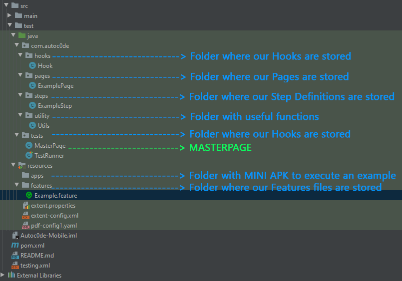
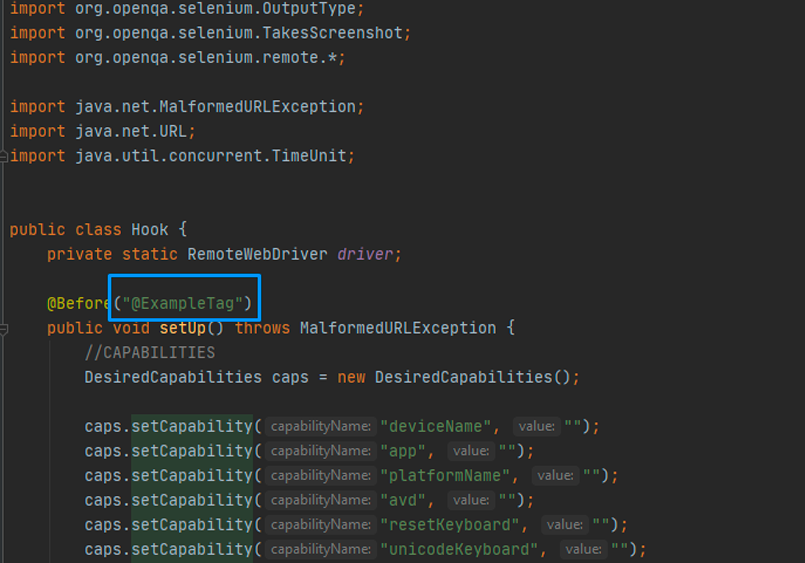
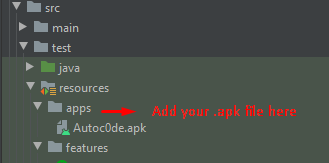
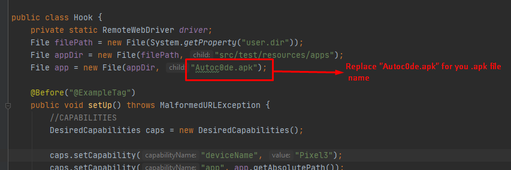
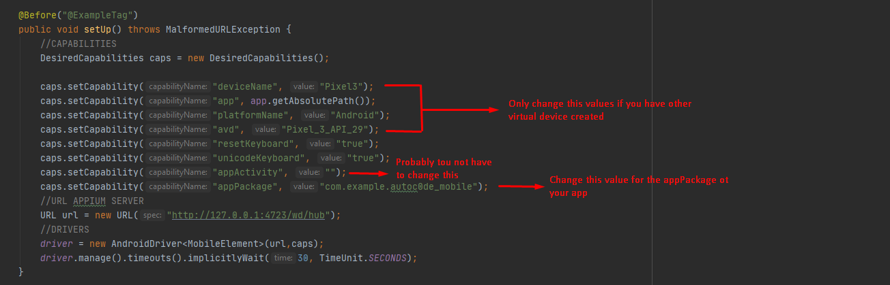

# Autoc0de: Automation Framework - Mobile 
## _Open source tests automation framework for mobile devices_


[](https://github.com/Joel-Vitelli/Autoc0de-Mobile)

## Indice

In this README.MD we will see the following topics:

- What can we do with this Framework
- What technologies are incorporated (Technological Stak)
- Project architecture
- Tools needed to run it locally and Steps to run the Framework
- How to change the suite to be run
- How to see a great Report
- How to configurate Autoc0de for your app

## What can we do with this Framework

- Add automated code reproducible through a virtual (or physical) mobile device (Android)
- Automate in BDD using **Gherkin** language
- Obtain at the end of each execution, three types of reports **(ExtentReport, ReportePFD, Cucumber Basic Report)**
- Use the framework's own functions to streamline repetitive tasks
- Execution **sequential** (Configurable to Parallel)

This framework is maked based on several technologies that are detailed in the next point. All open source

## Technological Stak

This Framework includes the following technologies:

- [Maven] - Java project management and construction tool
- [Java] - OO programming language.
- [Selenium] - Automation tool Web, Mobile, API, Desktop.
- [Appium] - Interface that allows us to connect to a Selenium server with a mobile device.
- [Cucumber] - Herramienta que nos permite generar scripts de prueba utilizando tests cases escritos en Gherkin **(Archivos.feature)**.
- [Gherkin] - Tool that allows us to generate tests scripts using tests cases written in Gherkin **(Files.feature)**.
- [Extent Report] - Intuitive reporter and very nice to look at.
- [TestNG] - Automation tool that will allow us to create Runners and use notations.
- [Android Studio AVD] - Necessary for creating virtual devices (Create Pixel 3 to run this suite).

**IDE recommended**
- [IntelliJ] - Excellent Ide for automation development

**Recommended plugins for IntelliJ**
- **Gherkin**
- **Cucumber for Java**


The technologies mentioned above are integrated into the framework through MAVEN in the **pom.xml** file. The versions are specified below:

| Technology | Maven version |Link Maven repo|
| ------ | ------ |------|
| Selenium-java | 3.141.59|https://mvnrepository.com/artifact/org.seleniumhq.selenium/selenium-java|
| TestNG maven | 7.4.0 |https://mvnrepository.com/artifact/org.testng/testng|
| Cucumber-java | 6.10.2 |https://mvnrepository.com/artifact/io.cucumber/cucumber-java|
| Cucumber-testng | 6.10.2 |https://mvnrepository.com/artifact/io.cucumber/cucumber-testng|
| Cucumber-core | 6.10.2 |https://mvnrepository.com/artifact/io.cucumber/cucumber-core|
| Appium Java-client | 7.5.0 |https://mvnrepository.com/artifact/io.appium/java-client|
| Extent Report Adapter | 2.7.0 |https://mvnrepository.com/artifact/com.aventstack/extentreports|

**Remember to keep these versions of Maven up to date as much as possible. If the project ever stops working, it could be because one of the versions found here has been deprecated / moved. However, it must be remembered that at the date this project was uploaded, all versions are the most current**

## Framework architecture

This Framework uses the automation pattern [Page Object] and is structured as follows.


```
.
│ .idea    
└── src
    ├── main
    │   ├── java
    │   ├── resources
    └── test
    │   ├── java   
    │   │   └── com.autoc0de
    │   │       ├── hooks  ------------------------------> Folder where our Hooks are stored            
    │   │       │   └── Hook.class ----------------------> Framework hook
    │   │       ├── pages -------------------------------> Folder where our Pages are stored
    │   │       │   └── ExamplePage.class ---------------> Example of a page
    │   │       ├── steps -------------------------------> Folder where our Pages are stored
    │   │       │   └── ExampleSteps.class --------------> Example of a step definition
    │   │       ├── utility -----------------------------> Folder with useful functions
    │   │       │   └── Utils.class ---------------------> File with useful functions
    │   │       └── tests -------------------------------> Folder with MasterPage and Runner of TestNG
    │   │           └── MasterPage.class ----------------> MasterPage with generic functions
    │   │           └── TestRunner.class ----------------> Runner of TestNG
    │   └── resources
    │       ├── apps ------------------------------------> Folder where we place our APK
    │       │   └── ExampleAPK.apk ----------------------> Mini APK to execute an example
    │       ├── features --------------------------------> Folder where out features files are stored
    │       │   └── Example.features --------------------> Example of a feature file
    │       ├── extent.properties -----------------------> Report properties
    │       ├── extent-config.xml -----------------------> Report config
    │       └── pdf-config1.yaml ------------------------> Report PDF properties
    ├── pom.xml -----------------------------------------> POM File of this framework
    └── testing.xml -------------------------------------> TestRunner config
```

<p align="center">
  
</p>

This project is based on 3 levels:
* Page objects (They are all our pages that in this case, are in the folder ```pages```)
* Step definitions (They are all the definitions of our steps written in [Gherkin], in this case, in the folder ```steps```)
* Features (These are all our .features files written in [Gherkin], in this case, in the folder ```features```)


## Tools needed to run it locally and Steps to run the Framework

In the ```Technological Stack``` section, we will find links that will take us to the websites to download all the tools we need. However, when using maven, we only need to install:
* Maven 3.6.3
* Java
* JDK
* Appium desktop
* Virtual device (Android Studio AVD, Genexus, etc.)

1. Install Maven 3.6.3
2. Install Java and JDK
3. Expose Maven and Java in environment variables
4. Install Appium desktop
5. Install Android studio, and create a new virtual device Pixel 3
6. Inside the root path of the newly cloned project, open the console and execute the following maven command: ```mvn install```. This will download all the necessary dependencies found in the ```pom.xml``` file

Once we have everything we need installed, to run the project we have 2 options:
* Inside the project with an ide (IntelliJ for example), select the file ```TestRunner.class```, right click on it, option "Debug"
* Open console within the path of the newly cloned project and execute the following maven command ```mvn clean install tests```

At this time we should be running the automatic tests on our Pixel 3 virtual device

7. When the execution finishes, we go to the folder ```target / Reports``` where we will find the ExtentReport report called``` Autoc0de-Mobile-HTML.html``` and the PDF report called ```Autoc0de-Mobile-PDF.pdf```
8. Finally, if we wish, we execute the maven command ```mvn clean``` to delete the folder ```target``` and all its content


## How to change the Suite that is going to be executed

To change the scenario we want to run, we have to modify the ```@Tag``` of [Cucumber] in the file ```TestRunner``` and in the file ```Hook``` as indicated in the following images:

```File Hook.class```

<p align="center">
  
</p>

```File TestRunner.class```

<p align="center">
  
</p>

Remember that the ```@tag``` that we are going to replace has to be identical in both files, and it has to exist within the feature that we want to execute, for example:

```File Feature.feature```

<p align="center">
  
</p>

## How to see a great Report

If we want to see the report, prior to the execution of the project, we have to go to the ```Target``` folder that is automatically generated in the project structure.

```
│ .idea    
└── src
└── Target
    ├── cucumber-reports -------------------> In this folder we found a basic cucumber report
    ├── generated-test-sources
    ├── Reports ----------------------------> in this folder we found 2 type of reports
        ├── Autoc0de-Mobile-HTML.html ------> Greater report of Extent Report
        ├── Autoc0de-Mobile-PDF ------------> PDF Report
    └── test-clases
```

It is as simple as looking for it, opening it with a browser and viewing it

* Extra Feature:
    * **Screenshots**: If in our test we have errors, Autoc0de will automatically generate a screenshot at the exact moment the execution failed.

Examples:
<p align="center">
Example of dashboard of our Report
</p>
<p align="center">
  
</p>
<p align="center">
Example of status of our steps
</p>
<p align="center">
  
</p>
<p align="center">
Example of a screenshot taked when the execution of test fail
</p>
<p align="center">
  
</p>
<p align="center">
Example of a exeption captured by the report
</p>
<p align="center">
  
</p>
<p align="center">
Example of the enviroment and system information
</p>
<p align="center">
  
</p>

# How to configurate Autoc0de for your app

If you want to use this Framework to automate your own mobile application (of course), you only have to follow the steps that I leave you below. Let's go to that

1. The first thing you have to do is add your .apk file inside the ```apps``` folder. You can remove the app from ```Autoc0de.apk``` if you prefer.

<p align="center">
  
</p>

2. Then, you have to replace the name of the ```.apk``` file set in the app property of the Cappabilities. For this, we go to the ```Hook.class``` file and change the name as seen in the following image

<p align="center">
  
</p>

3. Now, what we will do is place the ```Capabilities``` of our ```.apk```. To do this, we have to replace the following properties, by the properties of your apk:
   * ```appPackage```: name of the pakage ot your app
   * ```appActivity```: in some cases this is'n necesary to set 
   
   More information in the next image:
   
<p align="center">
  
</p>
   

4. And that's it. Now all you have to do is write your .feature file, define the steps and the functions that you will need to automate your test cases


# Enjoy!

## Architect, creator and developer of the framework
```sd
    * Joel Vitelli
```
## Distributed by
```sd
    * Underc0de.org
```

## Contributing Developers
```sd    
```

   
   
   [Maven]: <https://maven.apache.org/download.cgi>
   [Java]: <https://www.oracle.com/java/technologies/javase-jdk15-downloads.html>
   [Selenium]: <https://www.selenium.dev/documentation/en/>
   [Appium]: <https://appium.io/>
   [Cucumber]: <https://cucumber.io/>
   [Gherkin]: <https://cucumber.io/docs/gherkin/reference/>
   [Extent Report]: <https://www.extentreports.com/> 
   [TestNG]: <https://testng.org/doc/documentation-main.html>
   [Android Studio AVD]: <https://developer.android.com/studio>
   [IntelliJ]: <https://www.jetbrains.com/idea/>
   [Page Object]: <https://www.tutorialselenium.com/2019/02/05/page-object-model-selenium-webdriver/>